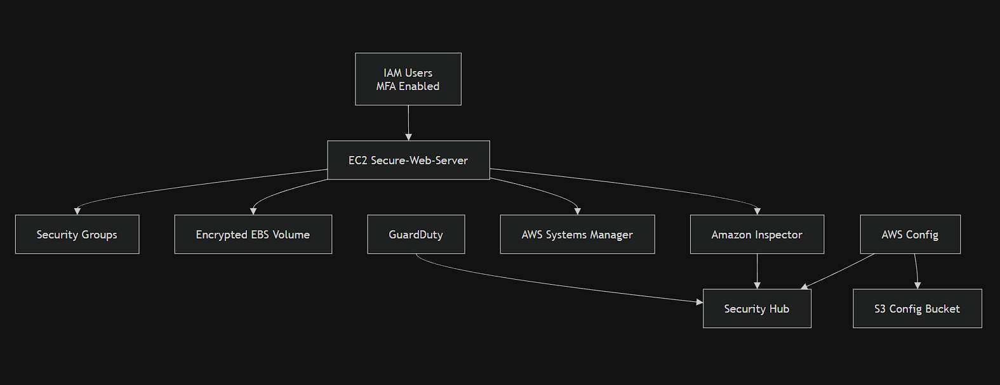
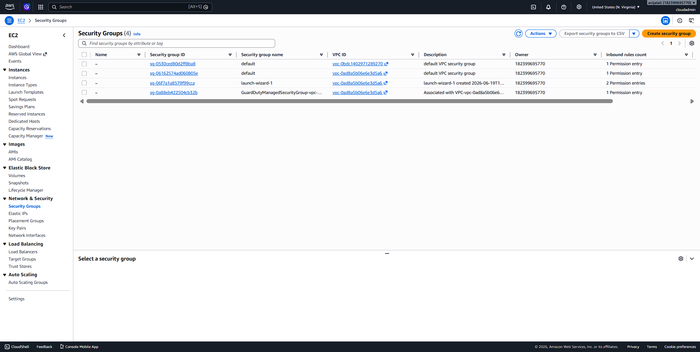
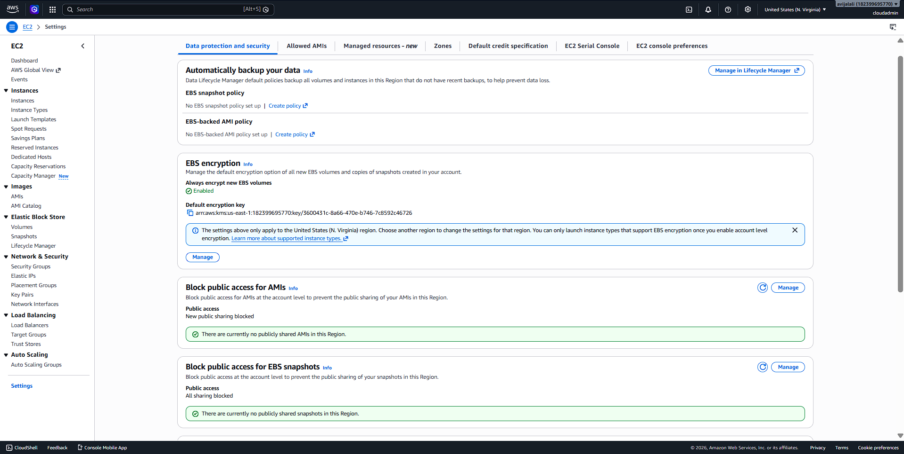
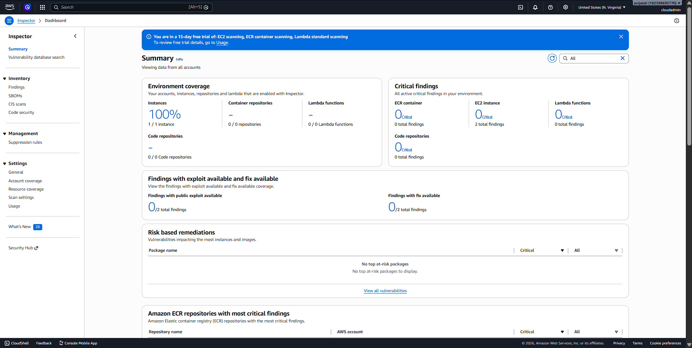
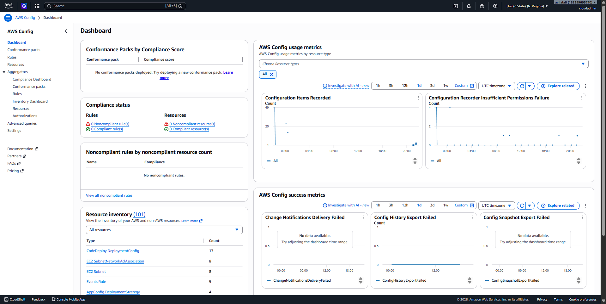
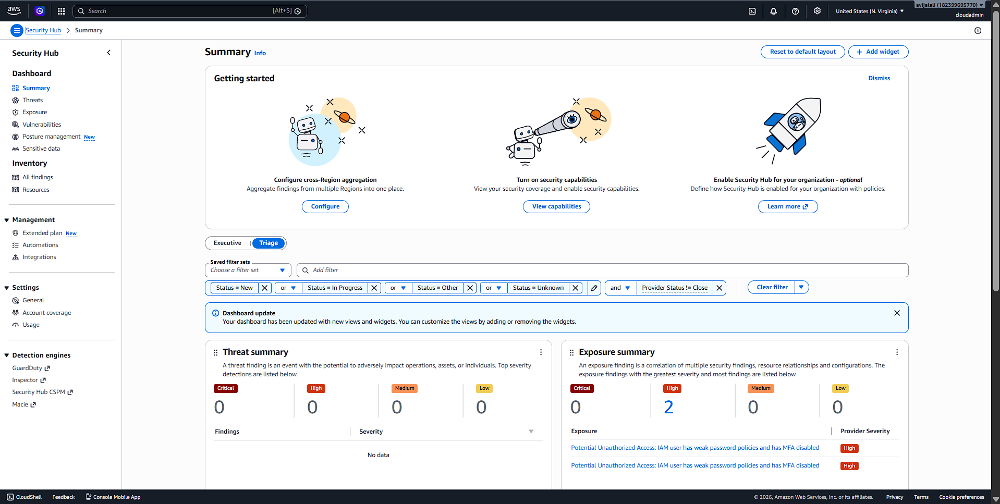

🔐 Secure AWS Enterprise Infrastructure

A hands-on cloud security project demonstrating how to build, secure, monitor, and manage an AWS environment using industry-standard AWS security services. This project focuses on implementing security best practices for identity management, encryption, vulnerability management, compliance monitoring, and centralized security visibility.

---

📌 Project Objectives

- Deploy a secure EC2-based infrastructure in AWS.
- Implement Identity and Access Management (IAM) security controls.
- Enable Multi-Factor Authentication (MFA).
- Encrypt storage using Amazon EBS encryption.
- Manage servers securely using AWS Systems Manager.
- Detect threats using Amazon GuardDuty.
- Perform vulnerability assessments using Amazon Inspector.
- Monitor compliance and configuration drift using AWS Config.
- Centralize security findings using AWS Security Hub.

---

🏗️ Architecture Diagram



---

🛠️ AWS Services Used

| Service | Purpose |
|----------|----------|
| Amazon EC2 | Hosted the secure Linux web server |
| IAM | User and permission management |
| MFA | Additional layer of authentication |
| Security Groups | Network-level firewall protection |
| Amazon EBS | Encrypted block storage |
| AWS Systems Manager | Secure instance management without SSH |
| Amazon Inspector | Vulnerability assessment and scanning |
| Amazon GuardDuty | Threat detection and continuous monitoring |
| AWS Config | Resource configuration monitoring and compliance |
| Amazon S3 | Stores AWS Config snapshots and configuration history |
| AWS Security Hub | Centralized security dashboard |

---

🏛️ Architecture Overview

```text
IAM Users (MFA Enabled)
          |
          ▼
   EC2 Secure-Web-Server
      /     |      \
     /      |       \
Security   EBS    Systems Manager
Groups   Encryption
                   |
                   ▼
          Amazon Inspector
                   |
                   ▼
             Security Hub
                   ▲
                   |
              GuardDuty
                   ▲
                   |
              CloudTrail Logs

AWS Config ─────────► Security Hub
     |
     ▼
S3 Configuration Bucket
```

---

🔒 Security Controls Implemented

1. Identity and Access Management (IAM)

- Created dedicated IAM users.
- Enabled Multi-Factor Authentication (MFA).
- Avoided using the root account for daily operations.
- Applied least-privilege principles.

---

2. Network Security

- Configured Security Groups as virtual firewalls.
- Restricted inbound access to only required ports.
- Eliminated overly permissive rules from default security groups.

---

3. Data Protection

- Enabled encryption by default for all new EBS volumes.
- Used AWS-managed KMS encryption keys.
- Blocked public access to EBS snapshots.

---

4. Systems Management

- Enabled AWS Systems Manager.
- Configured Default Host Management Configuration (DHMC).
- Managed EC2 instances without relying on SSH access.
- Enabled automatic SSM Agent updates.

---

5. Vulnerability Management

- Enabled Amazon Inspector scanning.
- Scanned EC2 instances for:
  - Operating system vulnerabilities
  - Software package vulnerabilities
  - Exposure to known CVEs

---

6. Threat Detection

- Enabled Amazon GuardDuty.
- Monitored for:
  - Suspicious API calls
  - Unauthorized access attempts
  - Credential compromise
  - Malicious network activity

---

7. Compliance Monitoring

- Enabled AWS Config.
- Configured continuous resource recording.
- Stored configuration history in an S3 bucket.
- Monitored resource configuration changes.

---

8. Centralized Security Monitoring

- Enabled AWS Security Hub.
- Aggregated findings from:
  - Amazon Inspector
  - Amazon GuardDuty
  - AWS Config

---

📸 Project Screenshots

IAM MFA Enabled


EC2 Secure Instance


Security Groups


Encrypted EBS


AWS Systems Manager


Amazon Inspector Dashboard


GuardDuty Dashboard


AWS Config Dashboard


AWS Security Hub Dashboard


---

🚨 Findings and Remediation

| Finding | Remediation |
|----------|-------------|
| IAM users without MFA | Enabled MFA for all IAM users |
| Default Security Groups too permissive | Removed unnecessary rules |
| Unencrypted storage | Enabled EBS encryption by default |
| Unmanaged EC2 instances | Enabled AWS Systems Manager |
| Lack of centralized visibility | Configured AWS Security Hub |

---

📈 Security Improvements Achieved

✅ Multi-Factor Authentication Enabled

✅ Encrypted Storage

✅ Centralized Security Monitoring

✅ Vulnerability Scanning

✅ Threat Detection

✅ Configuration Compliance Monitoring

✅ Secure Instance Management

✅ Reduced Attack Surface

---

💡 Skills Demonstrated

- AWS Cloud Security
- Identity and Access Management (IAM)
- Security Monitoring
- Vulnerability Management
- Threat Detection
- Security Compliance
- Infrastructure Hardening
- Incident Visibility
- AWS Security Best Practices

---

🎯 Resume Impact

This project demonstrates practical experience with:

- Amazon EC2
- IAM & MFA
- Security Groups
- Amazon EBS Encryption
- AWS Systems Manager
- Amazon Inspector
- Amazon GuardDuty
- AWS Config
- Amazon S3
- AWS Security Hub
- Cloud Security Architecture
- Security Operations and Monitoring

---

🚀 Future Enhancements

- Implement AWS Organizations and multi-account security.
- Add CloudWatch alarms and EventBridge automation.
- Configure automated remediation using AWS Lambda.
- Implement AWS WAF and Shield.
- Add SIEM integration with Amazon OpenSearch.

---

👨‍💻 Author

**Aayush Jalali**

- CompTIA Security+
- Aspiring Cloud Security Engineer

---

⭐ If you found this project useful, consider giving this repository a star.
